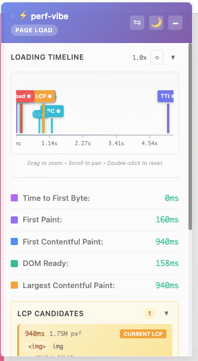

# perf-vibe

A Chrome browser extension that tracks and displays page performance metrics with visual change tracking in real-time.



## Features

### Performance Metrics
Track all critical Web Vitals and performance metrics:
- **TTFB** - Time to First Byte
- **FCP** - First Contentful Paint
- **LCP** - Largest Contentful Paint (with candidate history)
- **INP** - Interaction to Next Paint (worst interaction latency)
- **TTI** - Time to Interactive
- **TBT** - Total Blocking Time
- **CLS** - Cumulative Layout Shift
- **DOM Elements** - Total DOM element count
- **DOM Ready** - DOMContentLoaded event
- **Load Complete** - Window load event
- **First Paint** - First paint timing
- **Last Pixel Change** - When page stops visually changing

### Visual Timeline
- Interactive timeline chart showing all metrics
- Color-coded bars (green/yellow/red) based on performance thresholds
- Zoom and pan support (drag to zoom, scroll to pan, double-click to reset)
- Visual change markers with count badges
- **Activity Heat Strip** - Red gradient strip below the timeline showing page activity intensity over time (200ms intervals)

### Custom Metrics
- Track your own `performance.mark()` and `performance.measure()` calls
- Configure metric names in Settings (partial name matching supported)
- **Marks** display as colored pin markers on the timeline
- **Measures** display as purple range overlays above the bars showing duration
- Hover to see metric name and timing details

### Visual Changes Tracking
- Real-time tracking of DOM mutations
- History list showing all visual changes with timestamps
- Stability indicator showing when page stops changing
- Eye icon markers indicating visual stability points (no changes for 500ms+)
- LPC (Last Pixel Change) badge on the final visual change

### LCP Candidates
- Track all LCP candidate elements
- View element details (tag, selector, size, URL)
- Click to highlight element on page

### Content Density Heatmap
- Visual overlay showing where content is concentrated on the page
- Click the heatmap icon (▧) next to DOM Elements to toggle
- Color-coded grid: blue (less content) → green → yellow → red (more content)
- Helps identify content-heavy areas that may impact performance

### Network Waterfall
- Comprehensive resource loading visualization
- View all resources loaded within the first 8 seconds of page load
- Columns: Resource name, Domain, Size (decoded/transferred), Timeline bar, Duration
- Color-coded bars by resource type (JS, CSS, Images, Fonts, Documents, Other)
- Visual change markers overlaid on timeline showing DOM mutations
- **LCP line** (orange) - Shows when Largest Contentful Paint occurred
- **LPC line** (cyan) - Shows when page stopped visually changing
- Sort by Time, Size, or Duration
- Time scale automatically adjusts to ceiling of LPC value
- Click "View Waterfall" button after 8-second collection period completes

### Soft Navigation Support
- Automatic detection of SPA navigations (pushState, replaceState, popstate)
- Separate metrics for page load vs navigation
- Switch between Page Load and Navigation modes

### User Interface
- **Draggable widget** - Position anywhere on screen
- **Semi-transparent** - Doesn't block page content
- **Dark mode** - Toggle between light and dark themes
- **Collapsible sections** - Minimize timeline, LCP history, or visual changes
- **Responsive design** - Adapts to smaller screens

### Resources Section
- Real-time resource count and size tracking
- Total decoded size and transferred size display
- **Size thresholds with color indicators**: Green (<2MB), Orange (<4MB), Red (≥4MB)
- Breakdown by resource type (JS, CSS, Images, Fonts, Other)
- "View Waterfall" button to open detailed network waterfall chart
- Button shows spinner during 8-second collection period

### Recording Controls
- **Start/Stop recording** - Pause metric collection on demand
- **Domain ignore list** - Block tracking on specific domains
- **Quick add domain** - One-click add current domain to ignore list
- **Close widget** - Hide widget for current tab session (survives reloads)

## Installation

1. Clone or download this repository
2. Open Chrome and navigate to `chrome://extensions/`
3. Enable "Developer mode" (toggle in top right)
4. Click "Load unpacked"
5. Select the `perf_vibe_plugin` folder

## Usage

Once installed, the widget automatically appears on every page.

### Header Controls (left to right)
| Icon | Function |
|------|----------|
| `⏺` | Start/Stop recording (red = recording, white = stopped) |
| `⇆` | Switch between Page Load and Navigation modes |
| `🌙/☀️` | Toggle dark/light mode |
| `⚙` | Open settings |
| `−/+` | Collapse/expand widget content |
| `✕` | Close widget for this tab |

### Settings
Click the gear icon to access settings:
- **Quick Add Domain**: Shows current domain with one-click add button
- **Domain Ignore List**: Enter domains (one per line) to block tracking
- **Custom Metrics**: Enter performance mark/measure names to track on the timeline
- Settings save immediately and close the panel

### Timeline Interactions
- **Drag** to select and zoom into a time range
- **Scroll** horizontally to pan when zoomed
- **Double-click** to reset zoom
- **Hover** over bars to see metric details

### Visual Changes List
- Click any item to highlight the element on the page
- Items with 👁 icon indicate stability points
- Items with LPC badge mark the last visual change

### Network Waterfall Chart
- Opens as a modal overlay when clicking "View Waterfall"
- Shows resources sorted by start time (sortable by Size or Duration)
- Hover over bars to see start time and duration details
- Visual change lines (light cyan) show when DOM mutations occurred
- LCP line (orange) marks the Largest Contentful Paint timestamp
- LPC line (bold cyan) marks the Last Pixel Change timestamp
- Legend shows resource type colors and visual markers
- Click outside or press close button to dismiss

## Files

```
perf_vibe_plugin/
├── manifest.json    # Chrome extension manifest (V3)
├── content.js       # Main plugin logic
├── styles.css       # Widget styling
└── README.md        # This file
```

## Performance Thresholds

Metrics are color-coded based on Google's Web Vitals thresholds:

| Metric | Good (Green) | Needs Improvement (Yellow) | Poor (Red) |
|--------|--------------|---------------------------|------------|
| TTFB | ≤800ms | ≤1800ms | >1800ms |
| FCP | ≤1800ms | ≤3000ms | >3000ms |
| LCP | ≤2500ms | ≤4000ms | >4000ms |
| INP | ≤200ms | ≤500ms | >500ms |
| TTI | ≤3800ms | ≤7300ms | >7300ms |
| TBT | ≤200ms | ≤600ms | >600ms |
| CLS | ≤0.1 | ≤0.25 | >0.25 |
| DOM Elements | ≤2,500 | ≤4,000 | >4,000 |
| Total Resources | <2MB | <4MB | ≥4MB |

## Browser Support

- Chrome 88+ (Manifest V3 support required)
- Edge 88+ (Chromium-based)

## Privacy

- All data is stored locally in the browser
- No external requests or data collection
- Domain ignore list stored in localStorage
- Tab session state stored in sessionStorage

## License

MIT License - Feel free to use and modify as needed.
